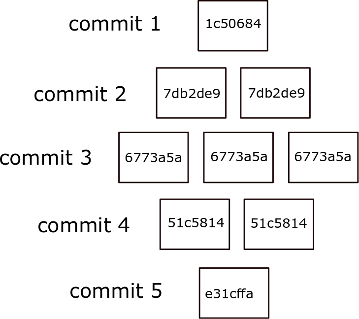

# Git Reverts

Git revert or rollbacks are performed with two statements: **revert** and **reset**. 
I recommend using the former because the reset command will remove items from the history.  
In this example however i will show you how to do both.  

In this sample there are 5 commits.  Note that the **commit id** is a 7 digit number.  for example `f271fa9`.  you can use this number to do reverts.  You can do the reverts one by one starting from last and moving down on list. 
You can also do ranges. 

 

## Revert
A revert will reverse what was done in the commit you are reverting.  The good thing about
it is that the changes stay in the history. changes are not lost.
 
### Method 1: one by one
1. from the history of commit you will see commit 5 to be last one so:
```
git revert e31cffa
```
2. now do the same thing with the second item on the list.
```
git revert 51c5814
```
3. keep going until you rever all items needed.

### Method 2: use a range of commits or heads
It also takes ranges. This will revert the last two commits:
```
git revert HEAD~2..HEAD
```
Similarly, you can revert a range of commits using commit hashes:
```
git revert a867b4af..0766c053 
```


## Reset
Remember that when you **reset** you **loose changes!!**
```
git reset --hard 05e9f89
```
then you have to do a push force if git push fails. This happens because the way git is configured.
```
git push –force
```

## Example

1. do a revert to commit 3
1. this get you to 3 files and each should say commit 3.
1. do a reset to delete commit five which stores the restore commit.

